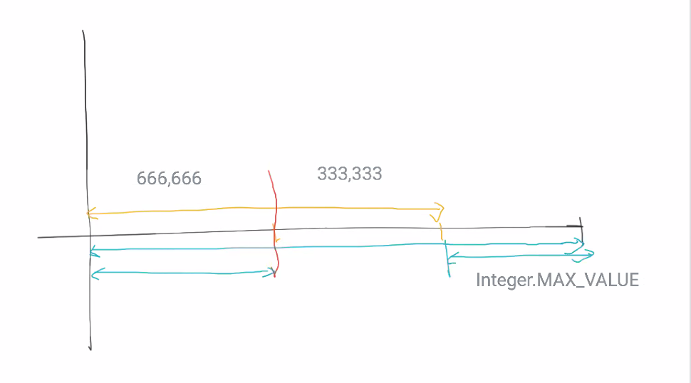

# Effective Java#11
see: https://github.com/jbloch/effective-java-3e-source-code/tree/master/src/effectivejava

## 9. プログラミング一般
iterator は while じゃなくて for であるべき。  
Effective Java の初版から書いてあること。

今の Java のライブラリには Sort のライブラリが2種類用意されている。  
Java7 くらいに書き直されている。

1. Quick Sort
2. Pivot Quick Sort

Binary Sort ではなくて、[Binary Search がバグ](https://ai.googleblog.com/2006/06/extra-extra-read-all-about-it-nearly.html) っていたことがある。  
Java の標準ライブラリがバグっていたというよりも、それ以前に書かれていたいくつかの Search にバグがあった。

2分探索するとき、つぎの真ん中を決めるときに足し算をして2で割るが、足し算をしたときにオーバーフローするパターンが考慮されていなかった。(ソフトウェア開発のアルゴリズムとして)  
足し算をしてオーバーフローを起こすような大きなデータを昔は扱えなかったから。

4半世紀、バグに誰も気づかなかった。

