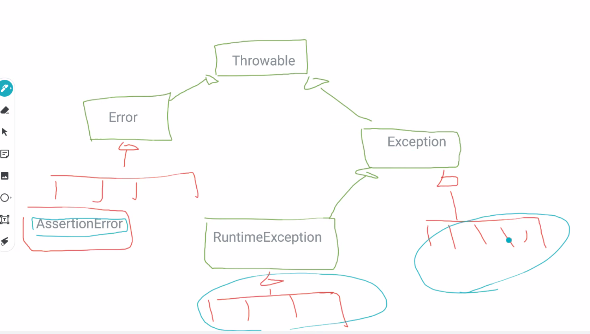

# Effective Java#12
see: https://github.com/jbloch/effective-java-3e-source-code/tree/master/src/effectivejava

## 70. 回復可能な状態にはチェックされる例外を、プログラミングエラーには実行時例外を使う
```
Throwable
↑       ↑
Error | Exception
↑       　↑
Runtime Exception
```



青い部分を使う。

AssertionError は、到達すべきではないときに到達してしまっているときなどに利用する。

### フェンスポストエラー
100M のフェンスに 10M の杭を打つ場合、両端も杭を打ちたいときは、11本必要。  
しかしこれについて1つ少なく計算してしまうような、計算ミスのことを指す。

## 11章 並行性
- 活性エラー: プログラムが先に進むことに失敗すること。
- 安全性エラー: プログラムが誤った結果を計算していること。