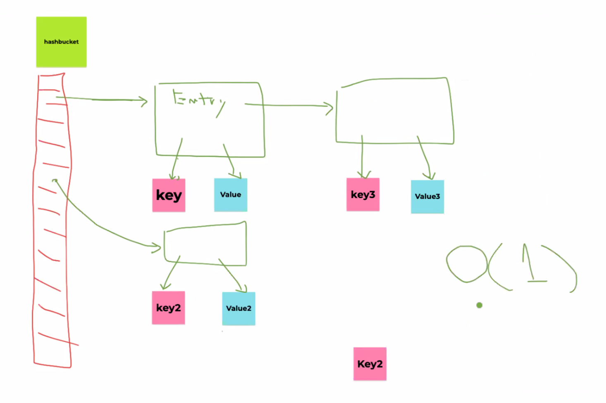
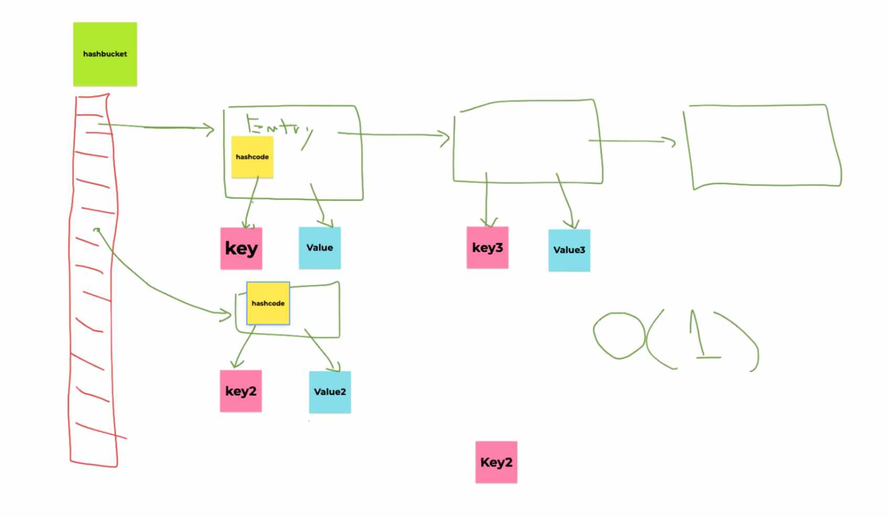

# Effective Java#3
see: https://github.com/jbloch/effective-java-3e-source-code/tree/master/src/effectivejava

## 自己紹介
テストファースト、そこまでかんたんではない。  
せめてコードを書いたのと同じ日にテストを書くと、良い感じ！

そうだな...とりあえず今回仕事で書く Apex はテストファーストでやろう。

https://www.youtube.com/watch?v=Q-FJ3XmFlT8&feature=youtu.be&t=1145

## 項目10 equals をオーバーライドするときは一般契約に従う

Enum は `==` で比較する。  

https://ja.wikipedia.org/wiki/同値類
この概念は結構むずかしい。

P44 の `list.contains(s)`:
どこかで cast するような構文があると？実行時例外を発生するかもしれない？ちょっとよくわからない。

`((CaseInsensitiveString) o).equalsIgnoreCase(s)`: 自分自身と比較

対称性を守らない equals はどんな結果になるかはわからない。

CounterPoint が Point のサブクラスであるには、CountPoint インスタンスをつくったときのふるまいは、Point と同じである必要がある。  
でないと、サブクラスとは言えないよ！

```
public class CountPoint extends Point {
    private static final AtomicInteger counter = new AtmicInteger();
    
    public CounterPoint(int x, int y) {
        super(x, y);
        counter.incrementAndGet();
    }
    public static int numberCreated() {
        return counter.get();
    }
}
```
Point クラスでこのような実装 (P45) をしちゃうと、等しくならない。

super クラスと同じふるまいをしましょう。

リスコフの置換原則: 長方形があったとき、正方形は長方形のサブクラス (?)

```
class Square extend Rectangle {
    Square(int side) {
        super(side, side);
    }

    public void setLength() {
        this.length = length;
        this.width = length;
    }
    
    public void setWidth() {
        this.width = width;
        this.length = width;
    }
}

class Rectangle {
    private int width;
    private int lenght;
    
    Rectangle(int width, int length) {
        this.width = width;
        this.length =length; 
    }
    
    public int length() {
        return length;
    }

    public int width() {
        return width;
    }

    // set を作ることで、崩れる。
    public void setLength(int length) {
        this.length = length;
    }

    public void setWidth(int width) {
        this.width = width;
    }
}
```

テスト:
```
class Test {
    int area(Rectangle r) {
        r.setWidth(100);
        r.setLength(200);
        return r.width() * r.length();
    }
}
```

Timestamp クラスは、Date と Timestamp を混在させてはならない。

暗黙の null 検査は好ましい。

```
@Override public boolean equals(Object o) {
    if (!(o instanceof MType)) return false;
    MyType mt = (MyType) o;
    ...
}
```

整数型は `==` で比較できる。float や double は、Double or Float.compare を使う。
浮動小数点計算は、実数と禁じている。

```
0.0 / 0.0 = NaN
```


Nan: 自分自身と比較しても false (Go でも一緒だった)

結論、equals メソッドはオーバーライドしないこと。

例の PhoneNumber、private final short なのに、function では int にしているのはなぜなのか。

→ 元データが int 型で利用していたが、内部的には short を利用している...といった背景があるのでは。

AutoValue: https://github.com/google/auto/blob/master/value/userguide/index.md

## 項目11 equals とオーバーライドするときは、常に hashCode をオーバーライドする

ハッシュコード: みだしのようなもの。

ハッシュコードは何のためにあるか。 
そもそもハッシュコードって何なのか。

- N 個のデータがある (ランダム) 中から、ある特定のデータを取得したい。
- O(N) で比較すれば良い。
- ソートされているときは O(log2N)
- O(1) にするためには:
    - データ量に関係なく、計算時間を一定にしたい。
        - そこで HashTable

Java の HashMap には、 HashBucket という配列がある。





最新の実装は、若干変わっているらしい。

Object.hashCode: int

HashBucket:
- キーを持つ。
- データを効率的に分類できる。
- 拘束に検索できる。

```
Map<PhoneNumber, String> m = new HashMap<>();
m.put(new PhoneNumber(999, 999, 9999), "Jenny");
```
なんと、`m.get(new PhoneNumber(999, 999, 9999))` は `null` になる。

ハッシュコードが一致しなければ equals で比較しない。

P55 のコード (かなり高度な遅延初期化):

```
private int hashCode;
@Override public int hashCode() {
    int result = hashCode;
    if (result == 0) {
        result = Short.hashCode(areaCode);
        result = 31 * result + Short.hashCode(prefix);
        result = 31 * result + Short.hashCode(lineNum);
        hashCode = result;
    }
    return result;
}
```

スレッドセーフな処理かどうか？  
いつも同じ結果になるので、この書き方でもいいとしている。(毎回同じ値)

実際利用されている場所がある: String.java (ハッシュ値を取ってきてゼロだったら計算して...)

類似: P334 単一チェックイデオム

Go の map も内部的には HashTable である。コンパイラが勝手に書いていく。


変更可能なものを key としていれて、その中身を書き換えると見つからなくなるの。   
みつからない key は HashMap に残り続けてメモリリークになる。GC で掃除もされない。  
key は不変が良い。

## 項目12 toString を常にオーバーライドする

コメントの重要性。

## おかわり
Lombok も自動生成する。secret 系はログに出てしまうのよろしくないので、@data とかつけると、全部作っちゃう。
toString だけ手書きするとか。

CI まかせになると、開発者が単体テストしかしなくなっちゃう。

Go の Testing パッケージは並列に書ける。