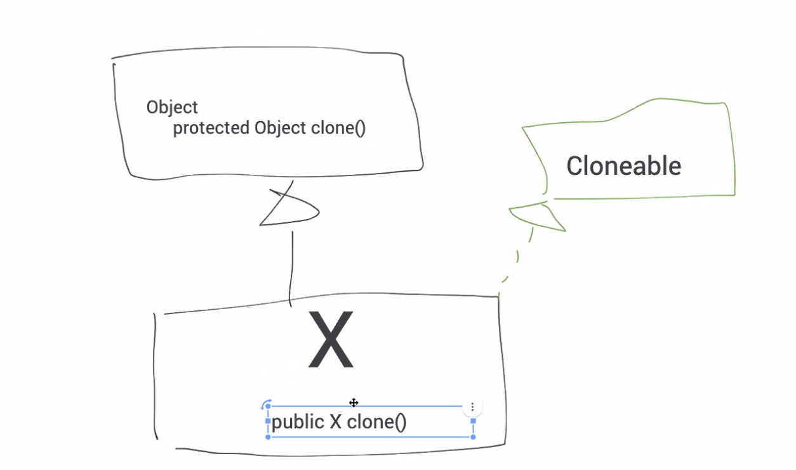

# Effective Java#4
see: https://github.com/jbloch/effective-java-3e-source-code/tree/master/src/effectivejava

今日から、本に書き込むことにした。(読み返すのにはそっちがいい)

みんな動くだけのシステムはいやなんだね。

## clone を注意してオーバーライドする


super.clone を呼び出すべき。

Object clone

この下に、サブクラス `x` がある。

```
x clone() {
    return new x(this);
}
```

さらにこの下に、サブクラス `y` がある。

```
y clone() {
    return (y) super.clone();
}
```

Clonable をどちらが実装しているかは、`x` だろうと `y` だろうとかわらない。

Java の 1.4 まではメソッドの戻り値が同じ型でなければ駄目。
(共変戻り値: 1.5 以降、super クラスの戻り値)

戻り値が同じじゃないと Override しているとはみなさない。(基本)

```
Object
protected Object clone()
```
```
PhoneNumber
public Object clone()
```
```
PhoneNumber
public PhoneNumber clone()
public Object clone()
```

Stack のオブジェクトは配列を指している。
```
Stack
Object[] elements

public Stack clone() {
    return (Stack) super.clone();
}
```

clone を使うのは配列だけ。
配列の copyOf も利用できるが、copyOf は長さを変更できる。まるっとコピーするときは clone を利用するのが定石。

https://docs.oracle.com/javase/jp/8/docs/api/java/util/Arrays.html#copyOf-T:A-int-


単純に clone したときに、同じもの (配列) を参照している。

- 高いレベルのメソッド: 公開メソッド
- 低いレベルのメソッド: 非公開のメソッド

## Comparable の実装を検討する
```
Set interfase (重複しないように入る Interface)
```

- TreeSet: 結果、ソートされている
- HashSet: 結果、ソートされていない

Hash と Tree はデータ構造を表しているだけ。

## public のクラスでは public のフィールドではなくアクセサメソッドを使う
GUI のサポートのためのパッケージ
- AWT: Abstract Window Toolkit
- Swing: AWS の後継
- JavaFX: 分離された